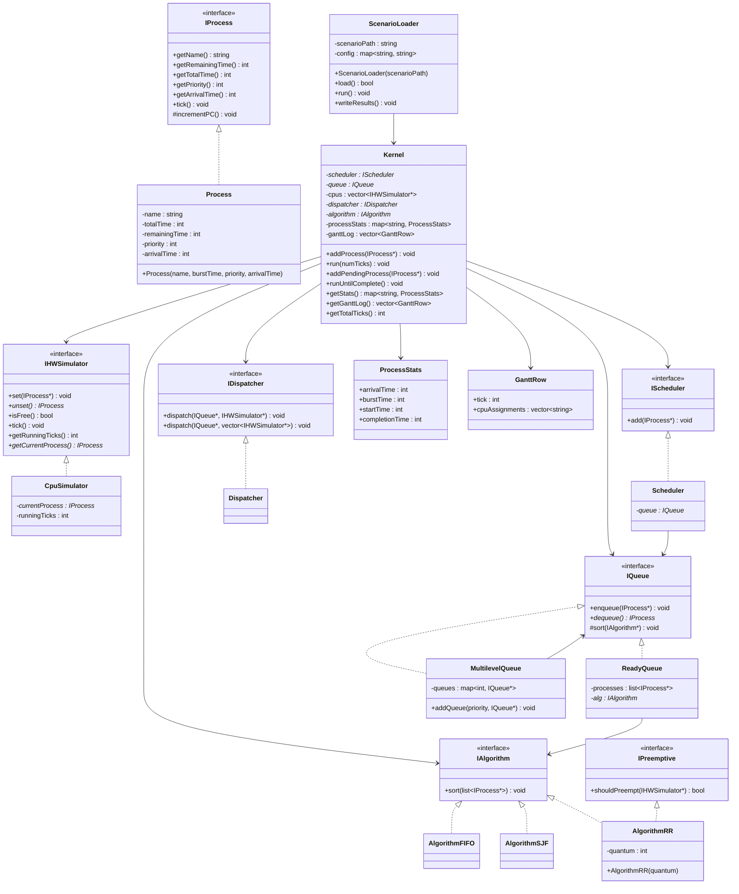
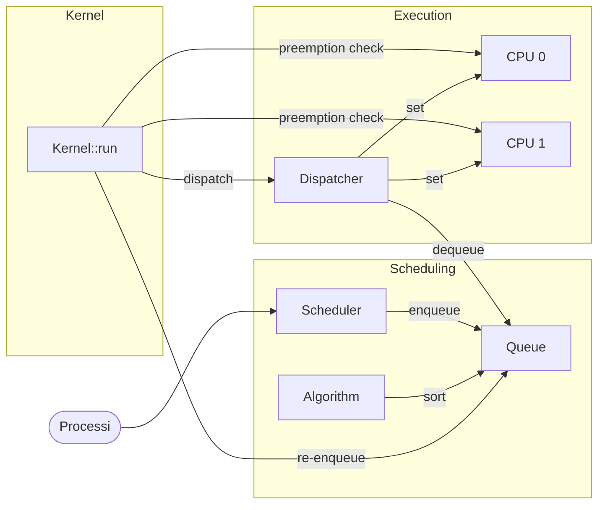
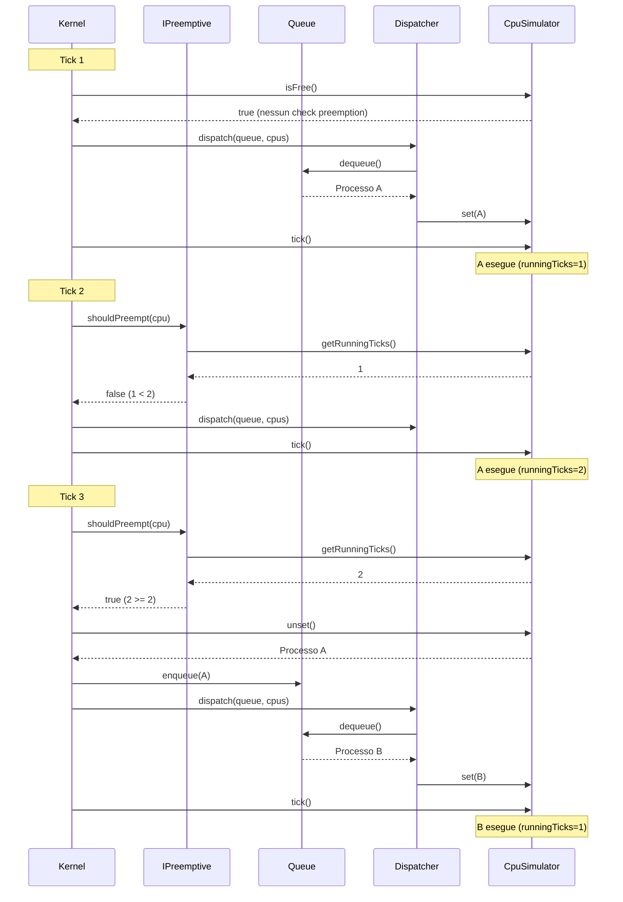

# Mini Scheduler

Simulatore di scheduling CPU con supporto per algoritmi FIFO, SJF, Round Robin, Multilevel Queue e multi-core.

## Compilazione

Compilazione senza stampe:

```bash
make
```

Compilazione con stampe di debug:

```bash
make DEBUG=1
```

## Esecuzione

Eseguire tutte le demo:

```bash
./scheduler
```

Eseguire una demo specifica:

```bash
./scheduler fifo|sjf|rr|mlq|multicore
```

## Scenari

Gli scenari permettono di definire processi e configurazione da file, eseguire la simulazione e raccogliere metriche (turnaround, waiting, response time) e diagrammi di Gantt.

### Struttura di uno scenario

```
scenarios/
  nome_scenario/
    processes.csv    # input: processi da simulare
    config.cfg       # input: configurazione algoritmo e core
    results.csv      # output: metriche per processo
    gantt.csv        # output: assegnamenti CPU per tick
```

### processes.csv

```csv
id,burst,arrival,priority
A,5,0,0
B,3,2,1
C,4,4,0
```

La colonna `priority` e' opzionale (default 0).

### config.cfg

```ini
# Algoritmo semplice
cores=2
algorithm=rr
quantum=3

# Multilevel Queue
cores=1
algorithm=mlq
mlq_levels=2
mlq_0_algorithm=rr
mlq_0_quantum=2
mlq_1_algorithm=fifo
```

Valori `algorithm`: `fifo`, `sjf`, `rr`, `mlq`.

### Esecuzione di uno scenario

```bash
./scheduler --scenario scenarios/fifo_basic
```

Genera `results.csv` e `gantt.csv` nella cartella dello scenario.

### Script Python per analisi e plot

```bash
python3 scenarios.py fifo_basic rr_multicore
```

Per ogni scenario genera:
- Tabella ASCII con metriche nel terminale
- `gantt.png` — diagramma di Gantt colorato per processo
- `metrics.png` — bar chart turnaround/waiting/response per processo

Se vengono passati piu' scenari, genera anche `scenarios/comparison.png` con medie a confronto.

Dipendenze: `matplotlib`, `numpy`.

### Scenari di esempio

| Scenario | Algoritmo | Core | Descrizione |
|----------|-----------|------|-------------|
| `fifo_basic` | FIFO | 1 | 3 processi con arrival time diversi |
| `rr_multicore` | Round Robin (q=2) | 2 | 4 processi su 2 core |

### Scenari di confronto

Sotto `scenarios/comparison/` sono presenti scenari che confrontano tutti gli algoritmi sugli stessi 5 processi (A-E), divisi in single-core e multi-core.

Processi comuni: `A(6,0,0)`, `B(4,1,1)`, `C(8,2,2)`, `D(3,4,3)`, `E(5,6,1)` — formato `(burst, arrival, priority)`.

#### Single-core (`comparison/single/`)

| Scenario | Algoritmo | Configurazione |
|----------|-----------|----------------|
| `comparison/single/fifo` | FIFO | 1 core |
| `comparison/single/sjf` | SJF | 1 core |
| `comparison/single/rr` | Round Robin | 1 core, quantum=3 |
| `comparison/single/mlq` | Multilevel Queue | 1 core, 4 livelli (RR+FIFO) |

#### Multi-core (`comparison/multi/`)

| Scenario | Algoritmo | Configurazione |
|----------|-----------|----------------|
| `comparison/multi/fifo` | FIFO | 4 core |
| `comparison/multi/sjf` | SJF | 4 core |
| `comparison/multi/rr` | Round Robin | 4 core, quantum=3 |
| `comparison/multi/mlq` | Multilevel Queue | 4 core, 4 livelli (RR+FIFO) |

#### Esecuzione confronto

```bash
# Eseguire tutti gli scenari di confronto
for dir in scenarios/comparison/single/* scenarios/comparison/multi/*; do
  ./scheduler --scenario "$dir"
done

# Generare plot comparativi
python3 scenarios.py comparison/single/fifo comparison/single/sjf comparison/single/rr comparison/single/mlq
python3 scenarios.py comparison/multi/fifo comparison/multi/sjf comparison/multi/rr comparison/multi/mlq
```

## Diagrammi

### Class Diagram



### Component Diagram



### Sequence Diagram — Esecuzione con Preemption (Round Robin, quantum=2)


